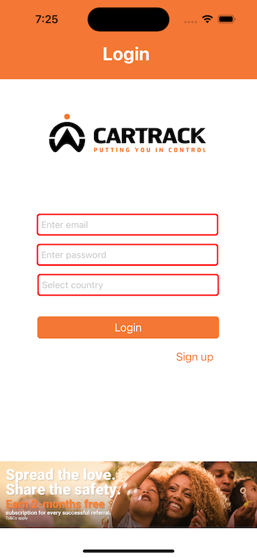
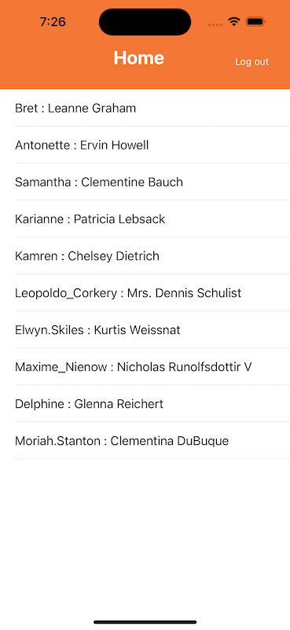
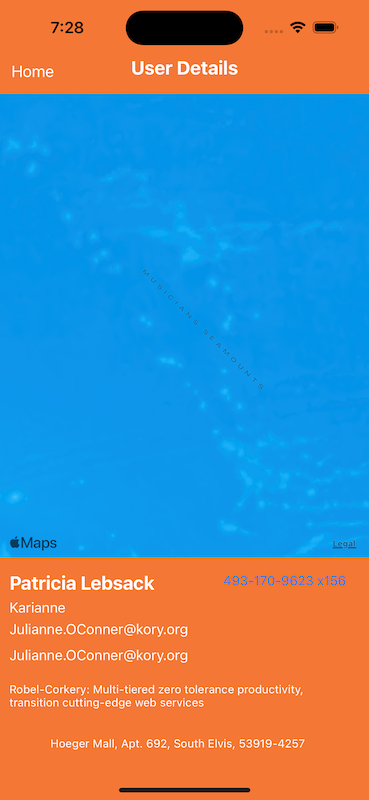

## This is a basic app with functionality Login, User List and User Details Page MVVM architecture used  

# Tech stacks used to develop the app

## 1. Swift with Storyboard
 
## 2. Architecture and Design Patterns 

        MVVM Architecture
        Coordinator Pattenr  
        Singleton Pattern
        Delegation Pattern 
        
## 3. Sqlite for Database 
## 4. Combine framework

# Pages Details

## Login Page
Enter any valid email and Password must be minimum 8 digit then select country

## User List Page 

## User Detail Page 

